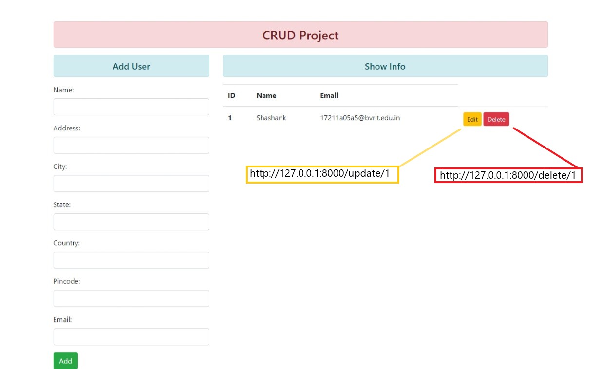

# CRUDApp

Django app to perform Create, Read, Update, Delete (CRUD) operations.


## Environment

```sh
$  pip install -r requirements.txt
```


## Run


```python
python manage.py makemigrations
python manage.py migrate
python manage.py runserver
```


## UI


